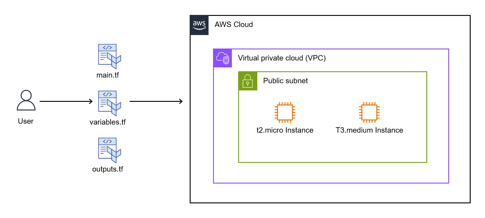
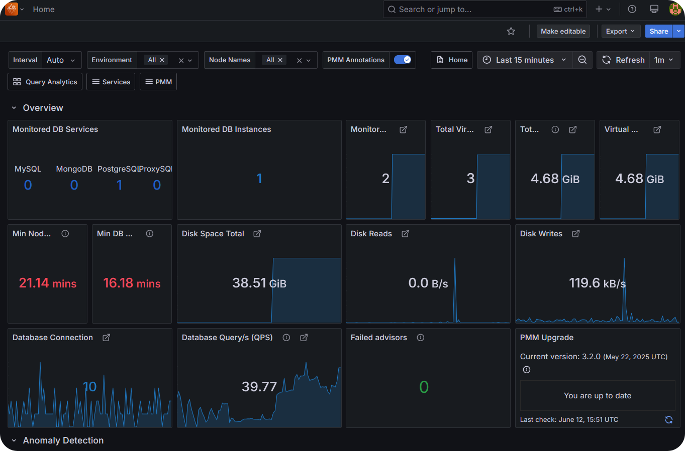

# Terraform - EC2 instances

## 🧾 Descripción

Este proyecto utiliza Terraform para aprovisionar dos instancias EC2 en AWS. Es una configuración mínima, pensada para demostrar el uso de infraestructura como código (IaC) con buenas prácticas.

## 🏗️ Arquitectura

- Dos instancias EC2 (`t2.micro y t3.medium`)
- Desplegadas en una misma VPC y subred
- Uso de un grupo de seguridad personalizado para puertos 22, 80, 443 y 8443
- Par de llaves para acceso SSH creado previamente en la consola de aws



## ✅ Requisitos Previos

- [Terraform](https://developer.hashicorp.com/terraform/downloads) versión 1.3 o superior
- AWS CLI configurado (`aws configure`)
- Una cuenta de AWS con permisos para crear recursos

## 🚀 Instrucciones de Uso

1. Clonar el repositorio:
   ```bash
   git clone https://github.com/Joseph1889/EC2Terraform
   cd EC2Terraform
   ```
2. Inicializar Terraform:
   ```bash
   terraform init
   ```
3. Revisar el plan de ejecución:
   ```bash
   terraform plan
   ```
4. Aplicar los cambios para crear la infraestructura:
   ```bash
   terraform apply
   ```
5. Eliminar la infraestructura:
   ```bash
   terraform destroy
   ```
## 📤 Salidas

Después de aplicar, Terraform mostrará:

- IP pública de cada instancia

## 📄 Notas Adicionales

Se prueba la utilidad de la instancias t3.medium mediante el despligue de un servidor 
Percona Monitoring and Management utilizando Docker. Para ello se deberá conectarse a dicha
instancia mediante SSH con la llave antes creada. Luego, en la instancia:

   ```bash
   sudo apt update
   sudo apt install -y docker.io
   sudo systemctl enable docker
   sudo systemctl start docker
   ```

Para verificar Docker:

   ```bash
   docker --version
   ```

Finalmente, desplegar la imagen del contenedor:

   ```bash
   sudo docker create -v /srv --name pmm-data percona/pmm-server:latest /bin/true

   sudo docker run -d \
      -p 80:8080 \
      -p 443:443 \
      -p 8443:8443 \
      --volumes-from pmm-data \
      --name pmm-server \
      --restart always \
      percona/pmm-server:latest
   ```

Luego se podrá validar el correcto despliegue accediendo mediante `https//:<IP_PUBLICA>`, donde luego de ingresar credenciales se podra viusalizar:
